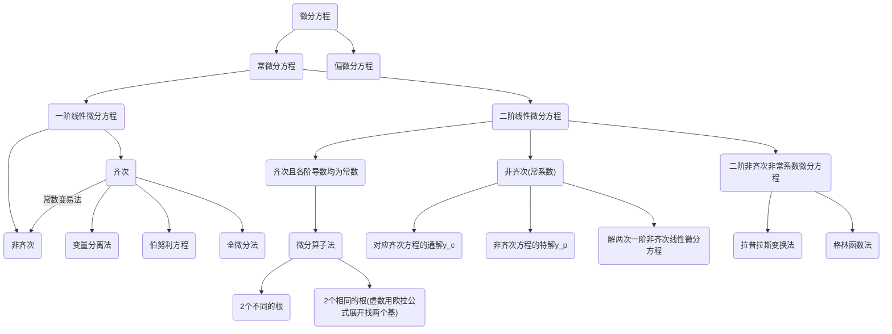

```mermaid
graph TD
A(微分方程)-->AA(常微分方程)
A-->AB(偏微分方程)
AA-->AAA(一阶线性微分方程)
AAA-->AAAA(齐次)
AAA-->AAAB(非齐次)
AAAA-- 常数变易法 --> AAAB
AAAA-->AAAAA(变量分离法)
AAAA-->AAAAB(伯努利方程)
AAAA-->AAAAC(全微分法)
AA-->AAB(二阶线性微分方程)
AAB-->AABA(齐次且各阶导数均为常数)
AABA-->AABAA(微分算子法)
AABAA-->AABAAA(2个不同的根)
AABAA-->AABAAB("2个相同的根(虚数用欧拉公式展开找两个基)")
AAB-->AABB("非齐次(常系数)")
AABB-->AABBA(对应齐次方程的通解y_c)
AABB-->AABBB(非齐次方程的特解y_p)
AABB-->AABBC(解两次一阶非齐次线性微分方程)
AAB-->AABC(二阶非齐次非常系数微分方程)
AABC-->AABCA(拉普拉斯变换法)
AABC-->AABCB(格林函数法)


```

